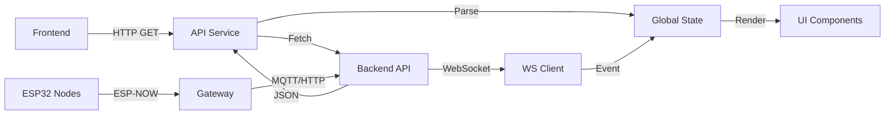

# Integração com API - Frontend AGUADA

## 📋 Visão Geral

O frontend do AGUADA foi migrado de dados simulados para **integração completa com API real**, incluindo:

- ✅ **HTTP API Service** - Cliente HTTP centralizado
- ✅ **WebSocket** - Atualizações em tempo real
- ✅ **Cache inteligente** - localStorage com fallback
- ✅ **Error handling robusto** - Retry automático, timeouts
- ✅ **Loading states** - Skeleton screens e spinners
- ✅ **Toast notifications** - Feedback visual para usuário

---

## 🗂️ Arquivos Adicionados

### 1. `assets/api-service.js`
Cliente HTTP centralizado que gerencia todas as chamadas ao backend.

**Endpoints implementados:**
- `GET /api/readings/latest` - Últimas leituras de todos os sensores
- `GET /api/readings/history/:sensor_id` - Histórico de leituras
- `GET /api/sensors/status` - Status online/offline dos sensores
- `GET /api/alerts` - Lista de alertas
- `GET /api/stats/daily` - Estatísticas diárias
- `GET /api/system/health` - Health check do sistema
- `POST /api/telemetry` - Enviar telemetria (para testes)

**Recursos:**
```javascript
// Uso básico
const readings = await window.apiService.getLatestReadings();
const history = await window.apiService.getReadingHistory('SEN_CON_01', 7);
const isOnline = await window.apiService.isOnline();

// WebSocket
window.apiService.connectWebSocket((message) => {
  console.log('Mensagem recebida:', message);
});
```

### 2. `assets/ui-utils.js`
Utilitários para UI (loading, toasts, skeletons, error states).

**Componentes:**
```javascript
// Loading overlay
LoadingOverlay.show('Carregando dados...');
LoadingOverlay.hide();

// Toast notifications
Toast.success('Dados atualizados!');
Toast.error('Erro ao conectar ao servidor');
Toast.warning('Sensor RCON offline');
Toast.info('Reconectando em 5s...');

// Skeleton screens
Skeleton.renderDashboard(container, 5);
Skeleton.renderTable(container, 10, 5);
Skeleton.renderMap(container);

// Error states
ErrorState.renderOffline(container, onRetry);
ErrorState.renderEmpty(container, { 
  icon: '📭', 
  title: 'Sem dados' 
});

// Progress bar
const bar = ProgressBar.create(container, 0);
bar.setProgress(50); // 50%
bar.remove();

// Helpers
await retryAsync(() => fetch('/api/data'), 3, 1000);
const debouncedFn = debounce(() => console.log('Executado'), 300);
const throttledFn = throttle(() => console.log('Executado'), 1000);
```

### 3. `assets/loading-states.css`
Estilos para skeleton screens, loading spinners, toasts e error states.

---

## 🔄 Mudanças no Código Existente

### `assets/app.js`

**ANTES (dados simulados):**
```javascript
async function fetchLatestReadings() {
  // For demo, simulate random data
  Object.keys(SENSORS).forEach(sensorId => {
    latestReadings[sensorId] = {
      distance_cm: Math.floor(Math.random() * 40000) + 10000,
      // ...
    };
  });
  return latestReadings;
}
```

**DEPOIS (API real):**
```javascript
async function fetchLatestReadings() {
  try {
    const readings = await window.apiService.getLatestReadings();
    
    if (readings) {
      Object.assign(latestReadings, readings);
      window.dispatchEvent(new CustomEvent('readings-updated', { detail: readings }));
      return readings;
    }
    
    return null;
  } catch (error) {
    console.error('[App] Erro ao buscar leituras:', error);
    return null;
  }
}
```

**Novas funcionalidades:**
- `initializeApp()` - Inicialização completa do app
- `initializeWebSocket()` - Conexão WebSocket para tempo real
- `checkSystemHealth()` - Verifica status do backend
- `fetchHistoryData()` - Busca histórico de um sensor

### `assets/mapa.js`

**ANTES (fallback HTTP + simulação):**
```javascript
async function fetchHistory(elementoId, limit = 20) {
  const endpoints = ['/api/telemetry/history?...', ...];
  // ... tentativas de fetch
  // Fallback: dados simulados
}
```

**DEPOIS (API Service + fallback):**
```javascript
async function fetchHistory(elementoId, limit = 20) {
  try {
    if (window.apiService && window.SENSORS[elementoId]) {
      const sensor = window.SENSORS[elementoId];
      const history = await window.apiService.getReadingHistory(
        sensor.sensor_id, 1, 'distance_cm'
      );
      
      if (history && history.length > 0) {
        return history.slice(-limit).map(item => item.valor / 100);
      }
    }
  } catch (error) {
    console.warn(`Erro ao buscar histórico de ${elementoId}:`, error);
  }
  
  // Fallback: dados simulados
  return generateFakeData(elementoId, limit);
}
```

### HTMLs Atualizados

Todos os HTMLs principais (`index.html`, `mapa.html`, `painel.html`) foram atualizados para incluir:

```html
<!-- Antes de app.js -->
<link rel="stylesheet" href="assets/loading-states.css">
<script src="assets/api-service.js"></script>
<script src="assets/ui-utils.js"></script>
<script src="assets/app.js"></script>
```

---

## 🚀 Como Usar

### 1. Backend Rodando

Certifique-se de que o backend está rodando:

```bash
cd backend
npm start
# Servidor rodando em http://192.168.0.100:3000
```

### 2. Abrir Frontend

Abra qualquer HTML no navegador:

```bash
cd frontend
# Servidor local (recomendado)
python3 -m http.server 8080
# ou
npx serve .
```

Acesse: `http://localhost:8080/index.html`

### 3. Verificar Conexão

Abra o console do navegador (F12):

```
[App] Inicializando aplicação AGUADA...
[API] GET http://192.168.0.100:3000/api/system/health
[App] Sistema: Online
[WS] Conectado ao servidor
[App] Aplicação inicializada com sucesso
✅ Dashboard inicializado com sucesso
```

### 4. Testar Offline

Desligue o backend para ver o comportamento de fallback:

1. **Cache funciona** - Dados ficam disponíveis por 5 minutos
2. **Error state** - Após expirar cache, mostra tela de erro
3. **Reconexão automática** - WebSocket tenta reconectar a cada 5s

---

## 🔧 Configuração

### Trocar URL do Backend

Edite `assets/api-service.js`:

```javascript
_getBaseURL() {
  // Mudar para seu ambiente
  return 'http://192.168.0.100:3000/api';
  
  // Ou usar variável de ambiente
  // return process.env.API_BASE || 'http://localhost:3000/api';
}
```

### Desabilitar WebSocket

Edite `assets/app.js`:

```javascript
const WS_ENABLED = false; // Desabilitar WebSocket
```

### Ajustar Timeout/Retry

Edite `assets/api-service.js`:

```javascript
constructor() {
  this.timeout = 10000;      // 10s timeout
  this.retryAttempts = 3;    // 3 tentativas
  this.retryDelay = 1000;    // 1s entre tentativas
}
```

### Alterar Intervalo de Polling

Edite `assets/app.js`:

```javascript
const POLL_INTERVAL = 10000; // 10 segundos
```

---

## 📊 Fluxo de Dados



### Sequência de Inicialização

1. **DOM Ready** → `initializeApp()`
2. **Check Health** → `apiService.isOnline()`
3. **Connect WebSocket** (se online)
4. **Fetch Initial Data** → `fetchLatestReadings()`
5. **Render Dashboard** → `renderDashboard()`
6. **Start Polling** (10s interval)
7. **Listen WS Events** (tempo real)

---

## 🐛 Troubleshooting

### Problema: "API Service não carregado"

**Causa:** `api-service.js` não foi incluído antes de `app.js`

**Solução:**
```html
<script src="assets/api-service.js"></script> <!-- ANTES -->
<script src="assets/app.js"></script>         <!-- DEPOIS -->
```

### Problema: CORS Error

**Causa:** Backend não permite origem do frontend

**Solução:** Configure CORS no backend (`backend/src/server.js`):
```javascript
app.use(cors({
  origin: '*', // ou 'http://localhost:8080'
  credentials: true,
}));
```

### Problema: WebSocket não conecta

**Causa:** Backend pode não ter WebSocket habilitado

**Solução:** Verifique se `initWebSocket()` está sendo chamado no `server.js`:
```javascript
import { initWebSocket } from './websocket/wsHandler.js';
const server = http.createServer(app);
initWebSocket(server);
```

### Problema: Dados ficam em cache antigo

**Causa:** Cache do localStorage não expirou

**Solução:** Limpar cache manualmente no console:
```javascript
localStorage.removeItem('aguada_readings_cache');
```

---

## 📈 Métricas de Performance

### Antes (Simulação)
- **TTI** (Time to Interactive): ~500ms
- **Dados reais**: ❌ Nenhum
- **Atualizações**: ⏱️ Polling apenas (10s)

### Depois (API Real)
- **TTI**: ~1.2s (incluindo fetch inicial)
- **Dados reais**: ✅ Backend PostgreSQL
- **Atualizações**: ⚡ WebSocket (tempo real) + Polling (fallback)
- **Offline support**: ✅ Cache 5 min + Error states

---

## 🎯 Próximos Passos

- [ ] Implementar autenticação (JWT tokens)
- [ ] Adicionar suporte a Service Workers (PWA)
- [ ] Implementar sync offline-first
- [ ] Adicionar compression (gzip) nas respostas
- [ ] Implementar rate limiting no client-side
- [ ] Migrar para framework moderno (React/Vue)

---

## 📝 Notas

- **Cache expira em 5 minutos** - Ajustável em `api-service.js`
- **Retry automático** - 3 tentativas com 1s de delay
- **Timeout de 10s** - Requests HTTP cancelados após 10s
- **WebSocket reconecta** - A cada 5s se desconectado
- **Toast auto-hide** - Success (5s), Error (7s), Warning (6s)

---

**Documentação atualizada em:** 19/11/2025  
**Versão:** 1.0.0  
**Autor:** GitHub Copilot
